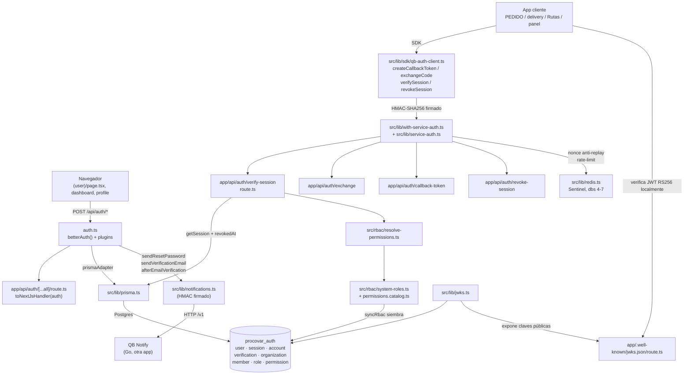

# Mapa interno de `auth`

`auth` (nombre real del paquete: `qb-auth`, "Identity Hub") es el login único de
Procovar: Next.js 16 + better-auth + Prisma sobre su propio Postgres
(`procovar_auth`). Aquí viven las personas, sus contraseñas, sus sesiones, a qué
sucursal pertenecen y qué rol tienen. Las demás aplicaciones (PEDIDO, delivery,
notify, Rutas, el panel...) no autentican por su cuenta: le preguntan a `auth`
por HTTP firmado y hacen lo que responde. El problema que resuelve es tener
una sola fuente de verdad para "quién es esta persona y qué puede hacer", en
vez de una tabla de usuarios y un `if rol == "supervisor"` distinto en cada app.

## Diagrama

## Piezas

| Pieza | Dónde vive | De qué se ocupa |
|---|---|---|
| Configuración de better-auth | `src/lib/auth.ts` | Da de alta email+contraseña (con lector de bcrypt heredado), Google OAuth, cookies cross-subdomain con prefijo `qb`, y declara los campos extra de `User` y `Session` |
| Handler HTTP de better-auth | `src/app/api/auth/[...all]/route.ts` | Monta todas las rutas propias de better-auth (`/api/auth/sign-in`, `/sign-up`, etc.) con `toNextJsHandler` |
| Esquema de datos | `prisma/schema.prisma` | `User`, `Session`, `Account`, `Verification` (tablas que better-auth espera tal cual) más `Organization`, `Member`, `Role`, `Permission`, `MemberRole` (RBAC propio de Procovar) |
| Catálogo de roles | `src/rbac/system-roles.ts` | Declara los nombres de rol exactos y qué permisos trae cada uno por defecto |
| Siembra de roles | `src/rbac/sync.ts`, `src/rbac/seed-core.ts` | Crea los roles del sistema en la base si faltan; nunca pisa lo que alguien cambió a mano desde la pantalla de permisos |
| Resolución de permisos | `src/rbac/resolve-permissions.ts` | Calcula el bloque `rbac` (permisos, wildcard, roles) que se manda a cada app en `verify-session` |
| Verificación de sesión | `src/app/api/auth/verify-session/route.ts` | La ruta que llaman las demás apps: valida el token, comprueba `revokedAt` a mano (better-auth no lo mira) y devuelve usuario + membresías + rbac |
| SSO entre apps | `src/lib/service-auth.ts`, `src/lib/with-service-auth.ts` | Firma y verifica peticiones entre servicios (HMAC, timestamp, nonce anti-replay en Redis) |
| SDK para las apps clientes | `src/lib/sdk/qb-auth-client.ts` | Fichero único que cada microservicio copia para hablar con `auth`: token de callback, canje de código, verificar sesión, revocar |
| Correo saliente | `src/lib/notifications.ts` | Llama a QB Notify (Go, otra app) para verificación de email, reset de contraseña, bienvenida e invitaciones |
| Redis | `src/lib/redis.ts` | Cliente Sentinel único, con bases separadas: 4 genérico, 5 locks/rate-limit, 6 sesiones/tokens, 7 caché |
| Claves de firma JWT | `src/lib/jwks.ts`, tabla `JwksKey`, `src/app/.well-known/jwks.json/route.ts` | Firma JWT de servicio (RS256) y publica las claves públicas para que cada app las verifique sin llamar a `auth` |
| Rol resuelto para el perfil propio | `src/lib/role-resolver.ts` | Distingue `admin/org-full/org-restricted/client` para la UI de perfil — **no** es el rol de negocio, usa el vocabulario nativo de better-auth (`owner`/`member`) |

## Las fronteras

- **Quién depende de `auth`**: PEDIDO, delivery, notify (Go), Rutas y el propio panel de `auth`. Ninguna guarda su propia tabla de roles ni compara permisos por su cuenta — todas preguntan a `POST /api/auth/verify-session` (documentado en `docs/PERMISOS-EN-CADA-APLICACION.md`). Hay una segunda ruta gemela, `POST /api/verify-session` (sin `/auth/`), que **nadie usa** salvo un `curl` viejo de un plan en `docs/superpowers/` — mientras exista hay que mantenerla igual a la buena o vuelve a romper.
- **Cómo hablan**: cada app copia `src/lib/sdk/qb-auth-client.ts` y firma sus peticiones con una clave HMAC derivada de `SERVICE_AUTH_SECRET` (una por `clientId`, ver tabla `ClientApp`). El navegador entra por cookie (`qb.session_token`, dominio compartido vía `crossSubDomainCookies`), no por este canal firmado.
- **Postgres**: una base propia, `procovar_auth`, vía Prisma (`DATABASE_URL` en el `docker-compose.yml` del propio repo, la comparte nadie más).
- **Redis**: el mismo Redis Sentinel de todo Procovar, prefijo de llaves propio y bases 4 a 7 reservadas para `auth` (ver regla de la casa en `procovar/CLAUDE.md`: si el prefijo de otra app coincide, un borrado se lleva las llaves de las dos).
- **Correo**: no manda correo directo — se lo pide a QB Notify (Go) por HTTP firmado (`QB_NOTIFY_URL`, HMAC con `QB_NOTIFY_KEY_ID`/`QB_NOTIFY_SECRET`); `auth` sólo arma el contenido en `src/lib/notifications.ts`.

## Cuidado con el esquema (la base y better-auth)

better-auth **no lee la base para saber qué columnas tiene**: lee lo que se le
declara en `src/lib/auth.ts` (`user.additionalFields`: `isSystemAdmin`, `phone`,
`username`; `session.additionalFields`: `clientId`, `revokedAt`) y da por hecho
que esas columnas existen en Postgres. Si una columna se borra de la base pero
sigue declarada aquí, better-auth no falla al arrancar: falla en el primer login,
porque el `SELECT`/`INSERT` que genera pide una columna que ya no está. Así se
cayó el login entero durante horas. La regla es: **tocar `additionalFields` en
`auth.ts` y la migración de Prisma siempre juntos**, nunca uno sin el otro, y
antes de borrar una columna comprobar que no está en ninguno de los dos bloques.

## Los cinco roles (aviso: el código de hoy declara siete)

El comentario del modelo `Role` en `prisma/schema.prisma` dice que el catálogo
es de **cinco**: Super Admin, Administrador, Supervisor, Gestor, Operador — los
mismos en las ocho sucursales, para que "Operador" no se cree distinto ocho
veces. Pero `SYSTEM_ROLE_NAMES` en `src/rbac/system-roles.ts` ya trae **siete**:
`DESARROLLADOR, SUPER ADMIN, ADMINISTRADOR, GERENTE, SUPERVISOR, GESTOR,
OPERADOR` — el comentario quedó desactualizado cuando se añadieron
`DESARROLLADOR` y `GERENTE`. Sea cual sea el número real hoy, lo que importa
para el resto de Procovar es que **estos nombres se escriben tal cual** —
mayúsculas y el espacio de `SUPER ADMIN` incluidos— porque PEDIDO y las demás
apps comparan el campo `role` que devuelve `verify-session` como texto exacto
contra estas cadenas. Cambiar una aquí sin avisar a las demás las deja sin
reconocer a nadie con ese rol.

## Por dónde entrar

1. **`src/lib/auth.ts`** — toda la configuración de better-auth vive aquí: qué
   campos declara, cómo verifica contraseñas viejas y nuevas, qué cookies usa
   y qué dispara en cada evento (alta, verificación, reset). Es el centro real
   del proyecto.
2. **`prisma/schema.prisma`** — qué tablas espera better-auth y qué le añadió
   Procovar encima (organización, roles, permisos). Imprescindible antes de
   tocar cualquier migración.
3. **`src/rbac/system-roles.ts`** — los nombres de rol exactos y qué puede
   hacer cada uno; es lo que comparan como texto las demás aplicaciones.
4. **`src/app/api/auth/verify-session/route.ts`** — el contrato real con el
   resto de Procovar: qué le llega a cada app cuando pregunta "¿quién es y qué
   puede hacer?".
5. **`docs/PERMISOS-EN-CADA-APLICACION.md`** — no es código, pero explica la
   regla que todas las demás apps deben cumplir y documenta la trampa de la
   ruta `verify-session` duplicada.
